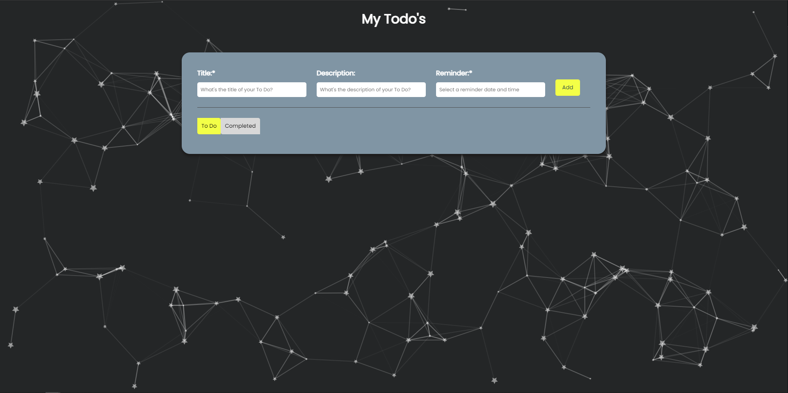

<div align="center">
<h1> React + Vite  Todo App
</div>

> **screenshot**


<h3>Getting Started</h3>

```shell
npm install
```
**and after that start the dev server**
```shell
npm run dev
```


Packages used
```
 react-icons
 @tsparticles/react  
 @tsparticles/slim
 react-datepicker
```

This template provides a minimal setup to get React working in Vite with HMR and some ESLint rules.

Currently, two official plugins are available:

- [@vitejs/plugin-react](https://github.com/vitejs/vite-plugin-react/blob/main/packages/plugin-react/README.md) uses [Babel](https://babeljs.io/) for Fast Refresh
- [@vitejs/plugin-react-swc](https://github.com/vitejs/vite-plugin-react-swc) uses [SWC](https://swc.rs/) for Fast Refresh
